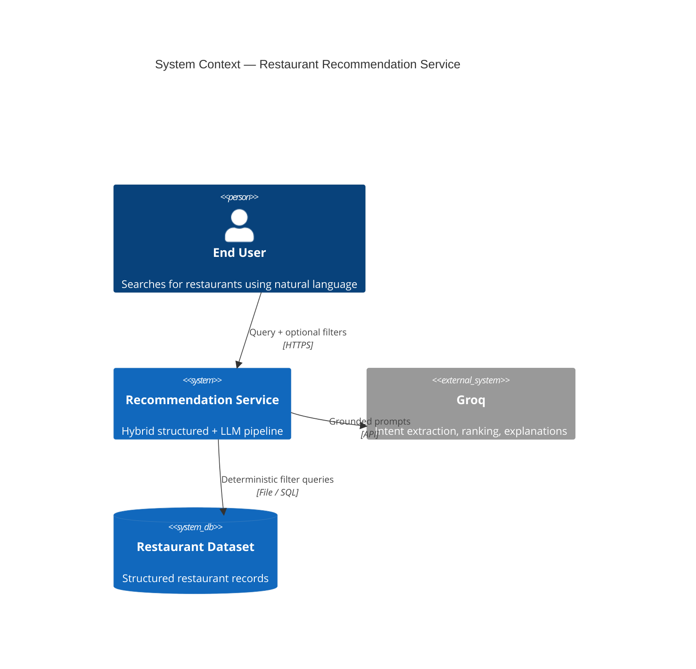
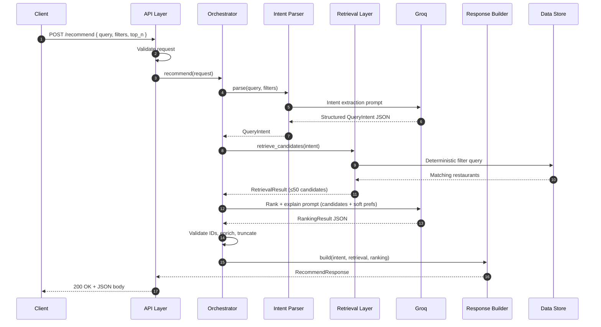
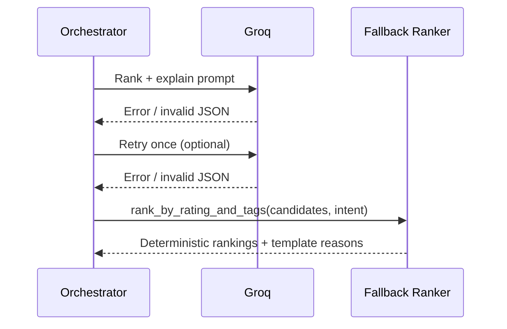
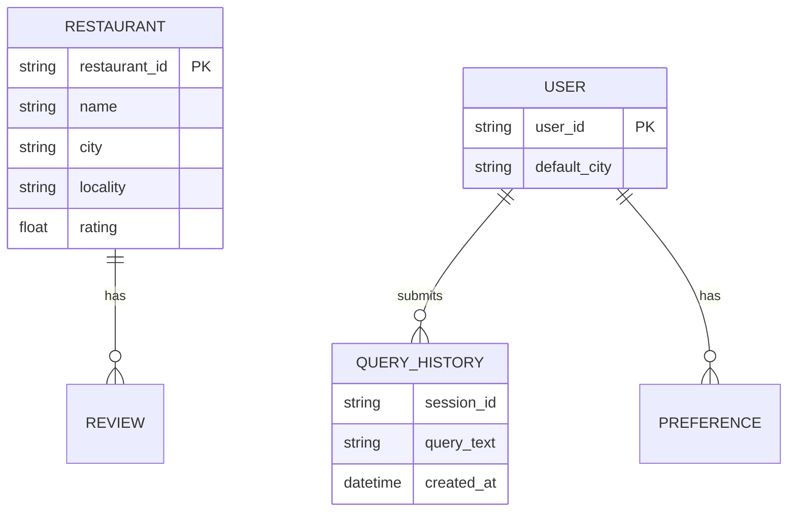
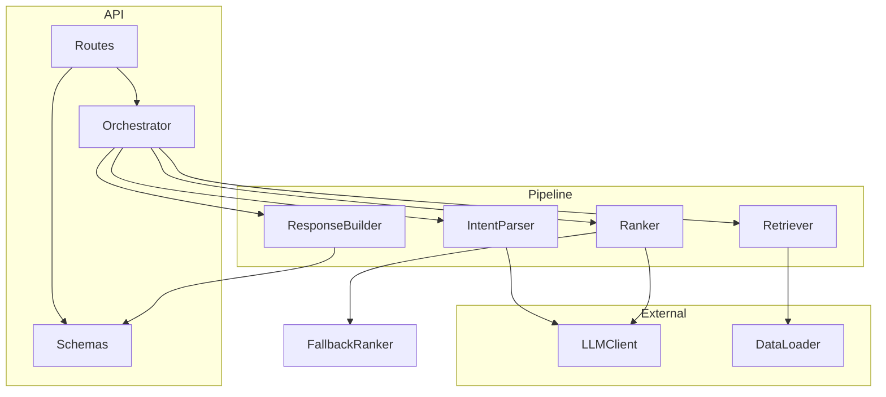

# Architecture — AI-Powered Restaurant Recommendation System

> **Document Type:** System Architecture Specification  
> **Source of Truth:** [`context.md`](../context.md) · [`PROBLEM STATEMENT.docx`](../PROBLEM%20STATEMENT.docx)  
> **Version:** 1.1  
> **Last Updated:** 2026-06-17  
> **LLM Provider:** Groq

This document describes the **detailed technical architecture** for a Zomato-inspired, AI-powered restaurant recommendation service. It expands the high-level design in the project context into implementable components, data flows, contracts, and operational concerns.

---

## Table of Contents

1. [Executive Summary](#1-executive-summary)
2. [Architecture Principles](#2-architecture-principles)
3. [System Context](#3-system-context)
4. [High-Level Architecture](#4-high-level-architecture)
5. [Component Design](#5-component-design)
6. [Request Lifecycle](#6-request-lifecycle)
7. [Data Architecture](#7-data-architecture)
8. [LLM Integration Strategy](#8-llm-integration-strategy)
9. [API Design](#9-api-design)
10. [Error Handling & Edge Cases](#10-error-handling--edge-cases)
11. [Non-Functional Requirements](#11-non-functional-requirements)
12. [Security & Configuration](#12-security--configuration)
13. [Recommended Project Structure](#13-recommended-project-structure)
14. [Technology Stack](#14-technology-stack)
15. [Deployment & Operations](#15-deployment--operations)
16. [Stretch Goals & Extension Points](#16-stretch-goals--extension-points)
17. [Evaluation & Testing Strategy](#17-evaluation--testing-strategy)

---

## 1. Executive Summary

The system solves **hybrid food discovery**: users express intent in natural language (often mixing hard constraints and subjective preferences), and the service returns a **ranked, explainable** list of restaurants drawn **exclusively** from a structured dataset.

The core architectural pattern is a **two-stage hybrid pipeline**:

| Stage | Mechanism | Purpose |
|-------|-----------|---------|
| **Deterministic retrieval** | SQL / pandas filters, rules | Enforce hard constraints; produce a bounded candidate shortlist (20–50) |
| **LLM reasoning** | Grounded prompt over candidates | Interpret soft preferences, rank, and explain — never invent restaurants |

Two **Groq** LLM touch-points are recommended for production quality (intent extraction + ranking/explanation), though an MVP may merge them into a single call. Groq's low-latency inference helps meet the 3–5 second response target.

**Primary endpoint:** `POST /recommend`  
**Default output size:** top 5 recommendations with match scores and 1–2 sentence reasons.

---

## 2. Architecture Principles

These principles are **non-negotiable** and drive every design decision.

### 2.1 Grounded Recommendations (No Hallucination)

- Every returned restaurant **must** exist in the dataset with a valid `restaurant_id`.
- The LLM receives only the pre-filtered candidate shortlist; it may rank and explain but **must not** fabricate names, attributes, or IDs.
- Post-LLM validation rejects any recommendation whose `restaurant_id` is not in the candidate set.

### 2.2 Separation of Concerns

Hard constraints are resolved **deterministically** before any LLM call. Subjective matching is delegated to the LLM **after** the search space is bounded.

```
Deterministic layer  →  "What CAN match?"
LLM layer            →  "What BEST matches intent, and WHY?"
```

### 2.3 Cost & Latency Control

- Pre-filter to 20–50 candidates before LLM ranking.
- Use structured JSON outputs from the LLM for reliable parsing.
- Cache intent parsing for identical queries where appropriate (stretch goal).

### 2.4 Graceful Degradation

When the LLM fails (timeout, invalid JSON, provider error), fall back to **deterministic ranking** (e.g., by `rating`, then `votes`) with templated explanations derived from attributes.

### 2.5 Explainability by Default

Every recommendation includes a human-readable reason grounded in **actual** restaurant fields (`ambiance_tags`, `description`, `price_range`, etc.).

---

## 3. System Context

### 3.1 Actors

| Actor | Role |
|-------|------|
| **End User** | Submits natural-language queries and optional structured filters via UI or API client |
| **Client Application** | Web UI (optional), mobile app, or direct API consumer |
| **Recommendation Service** | Backend orchestrating intent → retrieval → ranking → response |
| **Groq** | External LLM API for intent extraction and ranking (via Groq SDK) |
| **Restaurant Data Store** | Preprocessed JSON/CSV from Hugging Face Zomato dataset (MVP) or relational DB (scale) |

### 3.2 System Context Diagram



---

## 4. High-Level Architecture

### 4.1 Layered Architecture

```
┌─────────────────────────────────────────────────────────────────┐
│                     Client / UI (Optional)                      │
│              Search box, result cards, follow-up chat           │
└────────────────────────────┬────────────────────────────────────┘
                             │ HTTP
                             ▼
┌─────────────────────────────────────────────────────────────────┐
│                        API Layer                                │
│   POST /recommend  ·  Request validation  ·  Error mapping      │
└────────────────────────────┬────────────────────────────────────┘
                             │
                             ▼
┌─────────────────────────────────────────────────────────────────┐
│                     Orchestrator / Pipeline                     │
│   Coordinates intent → retrieval → ranking → response         │
└───┬─────────────────┬─────────────────────┬─────────────────────┘
    │                 │                     │
    ▼                 ▼                     ▼
┌──────────┐   ┌──────────────┐   ┌─────────────────────────────┐
│  Intent  │   │  Retrieval   │   │  Ranking & Reasoning        │
│  Parser  │   │  Layer       │   │  (LLM + fallback ranker)    │
│  (LLM)   │   │  (Determin.) │   │                             │
└──────────┘   └──────────────┘   └─────────────────────────────┘
    │                 │                     │
    └─────────────────┴─────────────────────┘
                             │
                             ▼
┌─────────────────────────────────────────────────────────────────┐
│                    Response Builder                             │
│   JSON assembly · constraint relaxation notes · metadata        │
└─────────────────────────────────────────────────────────────────┘
```

### 4.2 Two-LLM vs Single-LLM Modes

| Mode | Flow | Pros | Cons |
|------|------|------|------|
| **Two-LLM (recommended)** | LLM₁ intent → filter → LLM₂ rank/explain | Better control, lower ranker token cost, clearer debugging | Two API calls, slightly higher total latency |
| **Single-LLM (MVP)** | Combined intent + rank in one call after coarse filter | Simpler code, one round-trip | Harder to tune; may conflate parsing and ranking errors |

The orchestrator should abstract LLM calls so the pipeline can switch modes via configuration.

---

## 5. Component Design

### 5.1 API Layer

**Responsibility:** HTTP boundary, input validation, authentication (if added later), response serialization.

| Concern | Design |
|---------|--------|
| Framework | FastAPI (Python) or Express (Node.js) |
| Validation | Pydantic / Zod schemas for request and response bodies |
| Endpoints | `POST /recommend` (primary); optional `GET /health`, `GET /restaurants/{id}` |
| Idempotency | Not required for MVP; queries are read-only |

**Request validation rules:**

- `query`: optional string, max length enforced (e.g., 2000 chars)
- `filters`: optional object with typed fields (`city`, `locality`, `max_cost_for_two`, `is_veg`, `min_rating`, etc.)
- `top_n`: integer, default 5, max 20

### 5.2 Intent Parser

**Responsibility:** Convert natural language + explicit filters into a structured **Query Intent** object separating hard constraints from soft preferences.

**Input:**

- Raw `query` string
- Optional `filters` object (explicit overrides merge with or supersede parsed intent)

**Output — `QueryIntent`:**

```json
{
  "hard_constraints": {
    "city": "Bengaluru",
    "locality": "Indiranagar",
    "is_veg": true,
    "max_cost_for_two": 1500,
    "min_rating": 4.0,
    "cuisines": ["North Indian"],
    "open_now": false,
    "has_online_delivery": null
  },
  "soft_preferences": ["cozy", "romantic", "date-night", "good for groups"],
  "original_query": "cozy budget-friendly vegetarian place for a date in Indiranagar"
}
```

**Implementation options:**

| Approach | When to use |
|----------|-------------|
| **LLM with JSON schema** | Primary — handles nuance, typos, implicit locality |
| **Rule-based keyword parser** | Fallback if LLM unavailable; limited but deterministic |
| **Hybrid** | Rules extract obvious filters; LLM handles remainder |

**Merge policy for explicit `filters`:**

Explicit API filters **override** LLM-parsed values for the same field. Unspecified filter fields defer to parsed intent.

### 5.3 Retrieval Layer

**Responsibility:** Apply hard constraints deterministically; produce an ordered candidate shortlist for the LLM.

**Interface:**

```python
def retrieve_candidates(
    intent: QueryIntent,
    *,
    max_candidates: int = 50,
    relaxation_policy: RelaxationPolicy
) -> RetrievalResult:
    ...
```

**`RetrievalResult`:**

```json
{
  "candidates": [ /* Restaurant[] */ ],
  "applied_constraints": { /* what was actually enforced */ },
  "relaxed_constraints": [ /* e.g., "max_cost_for_two raised from 1000 to 1500" */ ],
  "total_before_limit": 42
}
```

**Filtering logic (deterministic):**

| Constraint | Filter rule |
|------------|-------------|
| `city` | Exact or normalized case-insensitive match |
| `locality` | Exact or fuzzy match on `locality` field |
| `cuisines` | Any overlap with restaurant `cuisines` list |
| `is_veg` | `true` → Veg or Both; `false` → Non-Veg or Both |
| `max_cost_for_two` | `average_cost_for_two <= max` |
| `min_rating` | `rating >= min` |
| `has_table_booking` | Boolean equality |
| `has_online_delivery` | Boolean equality |
| `open_now` | Compare current time (configured TZ) against `opening_hours` |
| `max_price_range` | `price_range <= max` |

**Candidate ordering before LLM (pre-rank):**

1. Higher `rating`
2. Higher `votes` (tie-breaker)
3. Optional: distance if user coordinates provided

**Constraint relaxation (ordered, configurable):**

When zero candidates match all hard constraints, relax in increasing severity:

1. `open_now` (if set)
2. `locality` → broaden to city-wide
3. `max_cost_for_two` → increase by configured step (e.g., +20%)
4. `min_rating` → decrease by 0.5
5. `cuisines` → drop least-specific cuisine requirement

Each relaxation is recorded for inclusion in the response `notes` field.

### 5.4 Ranking & Reasoning Layer

**Responsibility:** Rank the candidate shortlist against soft preferences; generate per-restaurant explanations and match scores.

**Input to LLM:**

- User's original query and `soft_preferences`
- Serialized candidate list (compact JSON — id, name, key attributes only)
- System instructions: rank ONLY from provided IDs; output strict JSON

**Output — `RankingResult`:**

```json
{
  "rankings": [
    {
      "restaurant_id": "R123",
      "match_score": 0.92,
      "rank": 1,
      "reason": "Cozy, dimly-lit ambiance ideal for a date, fully vegetarian, and within your budget in Indiranagar."
    }
  ]
}
```

**Post-processing:**

1. Validate all `restaurant_id` values ∈ candidate set
2. Enrich with full restaurant attributes from datastore
3. Truncate to `top_n`
4. If LLM returns fewer than `top_n`, fill remainder via deterministic pre-rank order with template reasons

**Fallback ranker (no LLM):**

```
score = 0.6 * normalized_rating + 0.4 * soft_tag_overlap(ambiance_tags, soft_preferences)
reason = template from top matching tags + price + rating
```

### 5.5 Response Builder

**Responsibility:** Assemble the final API response, including metadata and user-facing notes.

**Response schema:** See [Section 9](#9-api-design).

**Additional responsibilities:**

- Include `query_understood` echo for transparency/debugging
- Attach `notes` when constraints were relaxed or defaults applied
- Add `meta` block: latency, candidate count, LLM model used (optional)

### 5.6 Orchestrator (Pipeline Coordinator)

**Responsibility:** Single entry point wiring all components; handles transaction-like flow and error boundaries.

```python
async def recommend(request: RecommendRequest) -> RecommendResponse:
    intent = await intent_parser.parse(request.query, request.filters)
    retrieval = retriever.retrieve_candidates(intent)
    if not retrieval.candidates:
        return empty_response_with_guidance(intent)
    ranking = await ranker.rank(retrieval.candidates, intent, top_n=request.top_n)
    return response_builder.build(intent, retrieval, ranking)
```

---

## 6. Request Lifecycle

### 6.1 Sequence Diagram (Happy Path)



### 6.2 Sequence Diagram (Fallback Path)



### 6.3 Latency Budget (MVP Target: 3–5 seconds)

Groq's hosted inference is significantly faster than typical cloud LLM APIs, which makes the two-call pipeline viable within the latency budget.

| Phase | Target |
|-------|--------|
| API validation + orchestration overhead | < 50 ms |
| Intent parsing (Groq) | 300 ms – 800 ms |
| Retrieval (file/DB) | < 100 ms |
| Ranking + explanation (Groq) | 500 ms – 2 s |
| Response assembly | < 50 ms |

Parallelization opportunity: if using two Groq calls, retrieval cannot start until intent is parsed; ranking cannot start until retrieval completes. No parallelization on the critical path for MVP.

---

## 7. Data Architecture

### 7.1 Restaurant Entity Schema

| Field | Type | Required | Index / Filter | Notes |
|-------|------|----------|----------------|-------|
| `restaurant_id` | string | Yes | Primary key | Stable unique ID |
| `name` | string | Yes | — | Display name |
| `city` | string | Yes | Index | Normalized lowercase for matching |
| `locality` | string | Yes | Index | Neighborhood / area |
| `cuisines` | string[] | Yes | Index (GIN/array) | e.g., `["North Indian","Chinese"]` |
| `average_cost_for_two` | number | Yes | Index | Currency units (INR assumed) |
| `price_range` | int (1–4) | Yes | Index | 1 = cheap, 4 = expensive |
| `rating` | float (0–5) | Yes | Index | Aggregate rating |
| `votes` | int | Yes | — | Review count; tie-breaker |
| `is_veg` | enum | Yes | Index | `Veg` \| `Non-Veg` \| `Both` |
| `has_table_booking` | bool | Yes | Filter | |
| `has_online_delivery` | bool | Yes | Filter | |
| `ambiance_tags` | string[] | Yes | — | Critical for LLM soft matching |
| `opening_hours` | object | Yes | — | Per-day open/close; see below |
| `latitude` | float | No | Geo (stretch) | Distance ranking |
| `longitude` | float | No | Geo (stretch) | Distance ranking |
| `popular_dishes` | string[] | No | — | Helps LLM reasoning |
| `description` | string | No | Embedding (stretch) | Short blurb; generated at ingestion if absent in raw data |

**Extended Zomato-sourced fields** (optional, populated during ingestion):

| Field | Type | Required | Notes |
|-------|------|----------|-------|
| `address` | string | No | Full street address from Zomato |
| `phone` | string | No | Contact number |
| `url` | string | No | Zomato listing URL |
| `rest_type` | string[] | No | e.g., `["Casual Dining","Cafe"]` — used to derive `ambiance_tags` |
| `listed_in_type` | string | No | Zomato listing category |
| `listed_in_city` | string | No | Zomato listing city label |

### 7.2 Data Ingestion Pipeline (Hugging Face → JSON)

The problem statement requires loading the Zomato dataset from Hugging Face and
preprocessing it into the canonical schema before the API loads it at startup.

**Source dataset:** [ManikaSaini/zomato-restaurant-recommendation](https://huggingface.co/datasets/ManikaSaini/zomato-restaurant-recommendation)

**Ingestion module:** `src/app/data/ingest.py`

```
HuggingFace dataset (raw rows)
        │
        ▼
  transform_row()          ← parse rate, cost, cuisines, booleans
        │
        ▼
  derive fields            ← is_veg (heuristic), ambiance_tags, description,
                             price_range, default opening_hours
        │
        ▼
  deduplicate              ← keep highest-voted (name, locality) pair
        │
        ▼
  data/restaurants.json    ← loaded by RestaurantStore at startup
```

**Run ingestion (one-time or on refresh):**

```bash
cd src
python -m app.data.ingest
```

**Raw → canonical field mapping (selected):**

| Raw Zomato field | Canonical field |
|------------------|-----------------|
| `name` | `name` |
| `location` | `locality` (lowercase) |
| `cuisines` | `cuisines` |
| `approx_cost(for two people)` | `average_cost_for_two` |
| `rate` (`4.1/5`, `NEW`, `-`) | `rating` (0.0–5.0) |
| `votes` | `votes` |
| `book_table` / `online_order` | `has_table_booking` / `has_online_delivery` |
| `dish_liked` | `popular_dishes` |
| `rest_type`, `listed_in(type)` | `rest_type`, `ambiance_tags` (derived) |
| *(not in raw data)* | `opening_hours` (default 11:00–23:00), `is_veg` (heuristic) |

After deduplication the production JSON typically contains **~12k** Bengaluru
restaurants (exact count depends on ingestion run).

### 7.3 Opening Hours Structure

```json
{
  "monday":    { "open": "11:00", "close": "23:00" },
  "tuesday":   { "open": "11:00", "close": "23:00" },
  "wednesday": { "open": "11:00", "close": "23:00" },
  "thursday":  { "open": "11:00", "close": "23:00" },
  "friday":    { "open": "11:00", "close": "01:00" },
  "saturday":  { "open": "11:00", "close": "01:00" },
  "sunday":    { "open": "11:00", "close": "23:00" }
}
```

**`open_now` logic:** Parse current weekday and time in configured timezone; handle overnight hours (close < open means closes next calendar day).

### 7.4 Storage Options

| Tier | Technology | Use case |
|------|------------|----------|
| **MVP** | Preprocessed JSON + pandas / in-memory DataFrame | ~12k Zomato records; fast bootstrap |
| **Production** | PostgreSQL or SQLite | Indexing, concurrent reads, larger datasets |
| **Semantic (stretch)** | pgvector / Pinecone / FAISS | Embedding search over `description` + tags |

**MVP load pattern:** Run `app.data.ingest` to generate `data/restaurants.json`;
load at startup into memory; refresh on re-ingestion or admin trigger.

### 7.5 Entity Relationship (Future Extensions)



User/session entities are **stretch goals** for conversational refinement and personalization.

---

## 8. LLM Integration Strategy (Groq)

This project uses **[Groq](https://groq.com/)** as its LLM provider. Groq serves open-weight models (Llama, Mixtral, etc.) on custom LPU hardware, delivering very low latency — well suited to the intent-parsing and ranking calls in this pipeline.

**SDK:** [`groq`](https://github.com/groq/groq-python) Python package (`pip install groq`).

**Recommended models:**

| Use case | Model | Rationale |
|----------|-------|-----------|
| Intent extraction | `llama-3.1-8b-instant` | Fast, sufficient for structured JSON extraction |
| Ranking + explanation | `llama-3.3-70b-versatile` | Stronger reasoning for subjective matching and explanations |
| Single-LLM MVP | `llama-3.3-70b-versatile` | One model for both steps if merging calls |

Both steps may use the same model for simplicity during early development.

### 8.1 Client Abstraction

Define a thin interface wrapping the Groq SDK so prompts and pipeline logic stay decoupled from API details:

```python
class LLMClient(Protocol):
    async def complete_json(
        self,
        system_prompt: str,
        user_prompt: str,
        schema: dict,
        *,
        temperature: float = 0.2,
        max_retries: int = 1
    ) -> dict: ...
```

**Implementation:** `GroqClient` using `groq.AsyncGroq` with `chat.completions.create`, requesting JSON output via system prompt instructions and `response_format={"type": "json_object"}` where supported.

Configuration via environment:

```
GROQ_API_KEY=...
GROQ_MODEL_INTENT=llama-3.1-8b-instant
GROQ_MODEL_RANK=llama-3.3-70b-versatile
GROQ_TIMEOUT_SECONDS=30
```

For a single-model MVP, set both model variables to the same value.

### 8.2 Prompt Design — Intent Extraction

**System prompt highlights:**

- Extract `hard_constraints` and `soft_preferences` separately
- Map colloquial terms ("cheap" → low `price_range`, budget ceiling)
- Do not invent restaurants or locations not implied by the query
- Output valid JSON matching schema

**User prompt template:**

```
Query: "{query}"
Explicit filters (override parsed values): {filters_json}

Return JSON with hard_constraints and soft_preferences.
```

### 8.3 Prompt Design — Ranking & Explanation

**System prompt highlights:**

- You will receive a fixed list of candidate restaurants by ID
- Rank ONLY from this list; never add or modify IDs
- `match_score` is 0.0–1.0 reflecting fit to soft preferences AND constraint satisfaction
- `reason` must cite only attributes present in the candidate data (max 2 sentences)
- If no candidate fits soft preferences well, still rank and explain trade-offs honestly

**Candidate payload (minimize tokens):**

Include: `restaurant_id`, `name`, `locality`, `cuisines`, `rating`, `average_cost_for_two`, `price_range`, `is_veg`, `ambiance_tags`, `description` (truncated), `popular_dishes`.

Omit: raw coordinates unless distance is requested.

### 8.4 Hallucination Guardrails

| Guardrail | Implementation |
|-----------|----------------|
| Bounded candidate set | Retrieval caps at 50; LLM never sees full catalog |
| ID whitelist validation | Reject LLM output IDs not in candidate set |
| Attribute grounding check | Optional: flag reasons mentioning tags not in record |
| Structured output | JSON mode via Groq `response_format` + prompt schema |
| Retry + fallback | One retry on parse failure; then deterministic ranker |

### 8.5 Groq-Specific Considerations

| Concern | Approach |
|---------|----------|
| **Rate limits** | Groq enforces per-model RPM/TPM limits; handle `429` with exponential backoff before fallback |
| **Token limits** | Respect model context windows; cap candidates at 50 and compact serialization |
| **Structured output** | Use `response_format={"type": "json_object"}`; validate parsed JSON against schema |
| **Errors** | Catch `groq.APIError`, `groq.RateLimitError`, and timeouts; route to fallback ranker |

**Example Groq call (ranking):**

```python
from groq import AsyncGroq

client = AsyncGroq(api_key=settings.groq_api_key)
response = await client.chat.completions.create(
    model=settings.groq_model_rank,
    messages=[
        {"role": "system", "content": system_prompt},
        {"role": "user", "content": user_prompt},
    ],
    temperature=0.2,
    response_format={"type": "json_object"},
)
content = response.choices[0].message.content
```

### 8.6 Token & Cost Estimates (MVP)

Assuming ~500 tokens per candidate × 30 candidates ≈ 15k input tokens for ranking.

Mitigations:

- Compact candidate serialization
- Reduce to top 20 after pre-rank if approaching context limits
- Use `llama-3.1-8b-instant` for intent parsing; `llama-3.3-70b-versatile` for ranking

---

## 9. API Design

### 9.1 `POST /recommend`

**Request:**

```json
{
  "query": "cozy budget-friendly vegetarian place for a date in Indiranagar",
  "filters": {
    "city": "Bengaluru",
    "max_cost_for_two": 1500,
    "is_veg": true,
    "min_rating": 4.0
  },
  "top_n": 5
}
```

| Field | Type | Required | Default | Description |
|-------|------|----------|---------|-------------|
| `query` | string | No* | — | Natural-language preference (*at least one of `query` or meaningful `filters` required) |
| `filters` | object | No | `{}` | Explicit structured overrides |
| `top_n` | int | No | 5 | Number of recommendations (max 20) |

**Success Response — `200 OK`:**

```json
{
  "query_understood": {
    "hard_constraints": {
      "city": "Bengaluru",
      "locality": "Indiranagar",
      "is_veg": true,
      "max_cost_for_two": 1500
    },
    "soft_preferences": ["cozy", "romantic", "date-night"]
  },
  "recommendations": [
    {
      "restaurant_id": "R123",
      "name": "Green Garden Cafe",
      "city": "Bengaluru",
      "locality": "Indiranagar",
      "rating": 4.5,
      "average_cost_for_two": 1200,
      "price_range": 2,
      "cuisines": ["North Indian", "Continental"],
      "is_veg": "Veg",
      "ambiance_tags": ["cozy", "romantic"],
      "match_score": 0.92,
      "rank": 1,
      "reason": "Cozy, dimly-lit ambiance ideal for a date, fully vegetarian, and within your budget in Indiranagar."
    }
  ],
  "notes": "No restaurant matched all constraints under Rs.1000, so the budget was relaxed to Rs.1500 to surface these matches.",
  "meta": {
    "candidate_count": 28,
    "latency_ms": 3200,
    "ranker": "groq",
    "groq_model": "llama-3.3-70b-versatile"
  }
}
```

**Error Responses:**

| Status | Condition | Body |
|--------|-----------|------|
| `400` | Invalid input (missing query+filters, bad types) | `{ "error": "validation_error", "details": [...] }` |
| `422` | Unprocessable query (empty after parsing) | `{ "error": "ambiguous_query", "message": "..." }` |
| `503` | Groq unavailable or rate-limited, fallback also failed | `{ "error": "service_unavailable" }` |
| `500` | Unexpected internal error | `{ "error": "internal_error" }` |

### 9.2 Optional Endpoints

| Method | Path | Purpose |
|--------|------|---------|
| `GET` | `/health` | Liveness + dataset loaded check |
| `GET` | `/restaurants/{id}` | Single restaurant detail |
| `POST` | `/recommend/chat` | Multi-turn refinement (stretch) |

---

## 10. Error Handling & Edge Cases

| Scenario | Behavior |
|----------|----------|
| **No location in query** | Use `filters.city`, configured default city, or return `422` asking for location |
| **Zero candidates after all relaxations** | `200` with empty `recommendations` and actionable `notes` (e.g., "Try broadening cuisine or location") |
| **Vague query** ("somewhere nice") | Default to popular/high-rated in default city; note in `notes` |
| **Conflicting constraints** ("cheapest fine-dining") | Parser surfaces both; ranker explains trade-off in reasons |
| **LLM invalid JSON** | Retry once with repair prompt; fallback to rating-based ranker |
| **LLM timeout** | Fallback ranker; set `meta.ranker = "fallback"` |
| **Hallucinated restaurant_id** | Strip invalid entries; backfill from deterministic order |
| **Empty dataset** | `/health` fails; `/recommend` returns `503` |
| **Typos in locality** | Fuzzy match or LLM normalization in intent parser |

---

## 11. Non-Functional Requirements

| Attribute | Target | Implementation |
|-----------|--------|----------------|
| **Accuracy** | 100% hard constraint compliance post-retrieval | Deterministic filters; no LLM in retrieval path |
| **No hallucination** | 0 fabricated restaurants | ID whitelist validation |
| **Explainability** | Reason per recommendation | LLM or template fallback |
| **Latency** | < 3–5 s P95 (MVP) | Groq low-latency inference, candidate cap, async I/O |
| **Cost efficiency** | Bounded LLM tokens per request | Pre-filter to ≤50; compact prompts |
| **Robustness** | Graceful empty/vague/error paths | Relaxation policy + fallbacks |
| **Maintainability** | Modular packages | Separate parser, retriever, ranker, api |
| **Observability** | Request logs, latency metrics | Structured logging; optional OpenTelemetry |

---

## 12. Security & Configuration

### 12.1 Secrets Management

- `GROQ_API_KEY` and all credentials in `.env` — **never** committed
- `.env.example` documents required variables without values
- Load config via `pydantic-settings` or equivalent

### 12.2 Input Safety

- Max query length
- Sanitize filter values (type coercion, bounds on numerics)
- Rate limiting (recommended for production public deployment)

### 12.3 LLM Safety

- System prompts instruct model not to follow injection attempts to ignore candidate constraints
- Do not pass PII beyond what the user submits in the query

### 12.4 Configuration Reference

| Variable | Required | Description |
|----------|----------|-------------|
| `GROQ_API_KEY` | Yes | Groq API key ([console.groq.com](https://console.groq.com)) |
| `GROQ_MODEL_INTENT` | No | Model for intent extraction (default: `llama-3.1-8b-instant`) |
| `GROQ_MODEL_RANK` | No | Model for ranking/explanation (default: `llama-3.3-70b-versatile`) |
| `GROQ_TIMEOUT_SECONDS` | No | Request timeout (default: 30) |
| `DATA_PATH` | Yes | Path to restaurant CSV/JSON |
| `DEFAULT_CITY` | No | Fallback when location missing |
| `MAX_CANDIDATES` | No | Default 50 |
| `DEFAULT_TOP_N` | No | Default 5 |
| `TIMEZONE` | No | For `open_now` logic (e.g., `Asia/Kolkata`) |
| `PORT` | No | Server port (default 8000) |

---

## 13. Recommended Project Structure

```
AI-Powered Restaurant Recommendation System/
├── docs/
│   ├── context.md              # Problem statement & requirements (source of truth)
│   └── architecture.md         # This document
├── data/
│   └── restaurants.json        # Preprocessed Zomato dataset (generated by ingest)
├── src/
│   └── app/
│       ├── __init__.py
│       ├── main.py             # FastAPI app entrypoint
│       ├── config.py           # Settings from env
│       ├── api/
│       │   ├── routes.py       # /recommend, /health
│       │   └── schemas.py      # Pydantic request/response models
│       ├── pipeline/
│       │   └── orchestrator.py # End-to-end recommend flow
│       ├── intent/
│       │   ├── parser.py       # Intent extraction
│       │   └── prompts.py      # Intent LLM prompts
│       ├── retrieval/
│       │   ├── retriever.py    # Deterministic filtering
│       │   ├── filters.py      # Individual filter functions
│       │   └── relaxation.py   # Constraint relaxation policy
│       ├── ranking/
│       │   ├── ranker.py       # LLM ranker + fallback
│       │   ├── fallback.py     # Deterministic ranker
│       │   └── prompts.py      # Ranking LLM prompts
│       ├── llm/
│       │   ├── client.py       # LLMClient protocol
│       │   └── groq_client.py  # Groq SDK implementation
│       ├── data/
│       │   ├── loader.py       # JSON/CSV load at startup
│       │   ├── ingest.py       # HuggingFace download + preprocessing
│       │   └── models.py       # Restaurant dataclass / schema
│       └── utils/
│           ├── hours.py        # open_now logic
│           └── validation.py   # ID whitelist checks
├── tests/
│   ├── test_retrieval.py
│   ├── test_intent_parser.py
│   ├── test_ranker_fallback.py
│   └── test_api.py
├── .env.example
├── requirements.txt
└── README.md
```

---

## 14. Technology Stack

| Layer | Recommendation | Rationale |
|-------|----------------|-----------|
| Language | **Python 3.11+** | Rich LLM SDK ecosystem, pandas for MVP data |
| API framework | **FastAPI** | Async, automatic OpenAPI docs, Pydantic validation |
| Data (MVP) | **JSON (from HF ingest) + pandas** | Real Zomato data; zero DB infra for MVP |
| Data (scale) | **PostgreSQL + SQLAlchemy** | Indexed filters, concurrent access |
| LLM | **Groq** | Low-latency inference via `groq` Python SDK; Llama 3.x models |
| Frontend (optional) | **React** or static HTML | Simple search + result cards |
| Testing | **pytest + httpx** | API and unit tests |
| Containerization | **Docker** (optional) | Reproducible deploys |

---

## 15. Deployment & Operations

### 15.1 MVP Deployment

```
Docker container → single process Uvicorn → in-memory dataset
Environment: GROQ_API_KEY, GROQ_MODEL_INTENT, GROQ_MODEL_RANK, DATA_PATH, DEFAULT_CITY
Health check: GET /health
```

### 15.2 Production Considerations

- Horizontal scaling: stateless API instances; shared DB for restaurant data
- Groq rate limits (`429`): exponential backoff, queue, or circuit breaker with fallback ranker
- Caching: Redis for identical `(query, filters)` within TTL (stretch)
- Monitoring: log `latency_ms`, `candidate_count`, `ranker` mode, relaxation events

### 15.3 Health Check Contract

```json
{
  "status": "ok",
  "dataset_loaded": true,
  "restaurant_count": 1250,
  "groq_configured": true,
  "groq_model_intent": "llama-3.1-8b-instant",
  "groq_model_rank": "llama-3.3-70b-versatile"
}
```

---

## 16. Stretch Goals & Extension Points

| Feature | Architectural impact |
|---------|---------------------|
| **Multi-turn chat** | Add session store; pass prior `query_understood` + rejected IDs into intent parser; new `/recommend/chat` endpoint |
| **Embedding search** | Insert vector retrieval step *before* or *alongside* hard filters for soft semantic match; hybrid score = filter + cosine similarity |
| **Personalization** | User preference profile merged into `soft_preferences` weighting |
| **Open now** | Already supported in retrieval; requires accurate `opening_hours` + timezone config |
| **Distance ranking** | Add user lat/lng to request; haversine pre-rank or hard max-distance filter |
| **Response caching** | Cache layer keyed by normalized intent hash |

Extension points are intentionally isolated:

- `Retriever` interface allows swapping pandas → SQL → hybrid vector
- `LLMClient` interface wraps Groq; swap implementation only if provider changes
- `RelaxationPolicy` is configurable strategy object

---

## 17. Evaluation & Testing Strategy

### 17.1 Automated Tests

| Test area | Cases |
|-----------|-------|
| Retrieval | Hard filters, relaxation order, open_now, zero results |
| Intent parser | Mock LLM responses; filter merge overrides |
| Ranker validation | Rejects hallucinated IDs; fallback triggers |
| API | Schema validation, happy path, error codes |
| Golden queries | Fixture-based expected constraint extraction |

### 17.2 Example Test Queries

From project context — use as integration test fixtures:

1. "Cheap vegetarian street food near MG Road, open right now."
2. "Romantic rooftop restaurant for an anniversary dinner, budget no concern."
3. "Family-friendly North Indian place that takes table bookings and seats large groups."
4. "Best-rated Chinese delivery under Rs.800 for two."
5. "A quiet cafe good for working with a laptop and good coffee."

### 17.3 Success Criteria

| Criterion | Measurement |
|-----------|-------------|
| Correctness | All returned IDs exist; hard constraints satisfied (or relaxation documented) |
| Relevance | Manual review: soft prefs reflected in top-3 order |
| Explainability | Reasons reference real `ambiance_tags` / attributes |
| Hybrid design | Retrieval and LLM responsibilities remain separated in code review |
| Latency | P95 < 5 s on sample dataset |

---

## Appendix A — Component Dependency Graph



---

## Appendix B — Glossary

| Term | Definition |
|------|------------|
| **Hard constraint** | Must-have filter (location, veg, max price) enforced deterministically |
| **Soft preference** | Subjective/nice-to-have (cozy, romantic) handled by LLM ranking |
| **Candidate shortlist** | Bounded set of restaurants post-retrieval sent to LLM |
| **Relaxation** | Intentional loosening of a hard constraint when no matches exist |
| **Grounded LLM** | Groq prompt includes only real candidate data; output validated against it |

---

*This architecture document is derived from [`context.md`](../context.md). For behavioral requirements, data fields, and deliverables, the context file remains authoritative; this document provides the implementable system design.*
