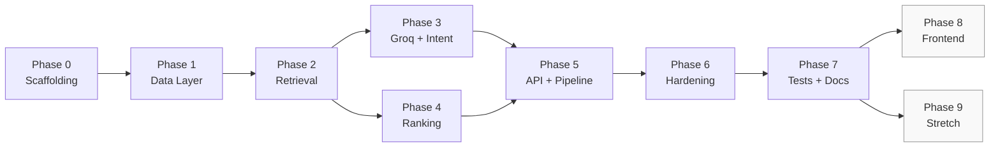

# Implementation Plan — AI-Powered Restaurant Recommendation System

> **Document Type:** Phase-wise Implementation Plan  
> **Derived From:** [`context.md`](../context.md) · [`architecture.md`](./architecture.md) · [`PROBLEM STATEMENT.docx`](../PROBLEM%20STATEMENT.docx)  
> **Version:** 1.1  
> **Last Updated:** 2026-06-17  
> **LLM Provider:** Groq

This document breaks the project into **sequential, testable phases**. Each phase has clear goals, tasks, deliverables, and acceptance criteria. Complete phases in order unless noted otherwise — later phases depend on earlier ones.

---

## Table of Contents

1. [Overview](#1-overview)
2. [Phase Map & Dependencies](#2-phase-map--dependencies)
3. [Phase 0 — Project Scaffolding](#phase-0--project-scaffolding)
4. [Phase 1 — Data Layer & Sample Dataset](#phase-1--data-layer--sample-dataset)
5. [Phase 2 — Deterministic Retrieval Engine](#phase-2--deterministic-retrieval-engine)
6. [Phase 3 — Groq Client & Intent Parser](#phase-3--groq-client--intent-parser)
7. [Phase 4 — Ranking, Reasoning & Fallback](#phase-4--ranking-reasoning--fallback)
8. [Phase 5 — Pipeline Orchestration & API](#phase-5--pipeline-orchestration--api)
9. [Phase 6 — Edge Cases, Hardening & Observability](#phase-6--edge-cases-hardening--observability)
10. [Phase 7 — Testing, Documentation & Demo](#phase-7--testing-documentation--demo)
11. [Phase 8 — Optional Frontend](#phase-8--optional-frontend)
12. [Phase 9 — Stretch Goals](#phase-9--stretch-goals)
13. [Deliverables Checklist](#13-deliverables-checklist)
14. [Risk Register](#14-risk-register)
15. [Appendix — Golden Test Queries](#appendix--golden-test-queries)

---

## 1. Overview

### 1.1 What We Are Building

A **hybrid recommendation backend** that:

1. Accepts natural-language queries and optional structured filters.
2. Filters restaurants **deterministically** on hard constraints.
3. Uses **Groq** to parse intent and rank/explain a bounded candidate shortlist.
4. Returns top-N grounded recommendations with match scores and reasons.

### 1.2 Implementation Strategy

| Principle | How it applies |
|-----------|----------------|
| **Bottom-up** | Data → retrieval → LLM → API (each layer testable in isolation) |
| **MVP first** | Working `/recommend` with hybrid pipeline before polish and stretch goals |
| **No hallucination from day one** | Retrieval and ID validation built before LLM ranking goes live |
| **Groq two-call pipeline** | Intent (`llama-3.1-8b-instant`) + rank (`llama-3.3-70b-versatile`) per architecture |

### 1.3 Estimated Timeline (Indicative)

| Phase | Focus | Est. effort |
|-------|-------|-------------|
| 0 | Scaffolding | 0.5 day |
| 1 | Data layer | 1 day |
| 2 | Retrieval | 1.5 days |
| 3 | Groq + intent | 1.5 days |
| 4 | Ranking + fallback | 1.5 days |
| 5 | Orchestrator + API | 1 day |
| 6 | Hardening | 1 day |
| 7 | Tests + docs | 1 day |
| **MVP total** | | **~8–9 days** |
| 8 | Frontend (optional) | 1–2 days |
| 9 | Stretch goals | Variable |

---

## 2. Phase Map & Dependencies



**Critical path:** 0 → 1 → 2 → 3 → 4 → 5 → 6 → 7

Phases 3 and 4 can partially overlap once Phase 2 is complete (different modules, no circular deps).

---

## Phase 0 — Project Scaffolding

**Goal:** Runnable Python project skeleton with config, dependencies, and folder layout matching the architecture — ready for Hugging Face dataset ingestion in Phase 1.

### Prerequisites

- Python 3.11+
- Groq API key ([console.groq.com](https://console.groq.com))

### Tasks

- [x] Initialize project directory structure per [architecture §13](./architecture.md#13-recommended-project-structure)
- [x] Create `requirements.txt`:
  - `fastapi`, `uvicorn[standard]`
  - `pydantic`, `pydantic-settings`
  - `pandas`
  - `datasets` — Hugging Face library for Zomato dataset download (Phase 1)
  - `groq`
  - `python-dotenv`
  - `httpx` (testing)
  - `pytest`, `pytest-asyncio`
- [x] Create `.env.example` with all config vars from [architecture §12.4](./architecture.md#124-configuration-reference)
- [x] Implement `src/app/config.py` using `pydantic-settings` (`Settings` class)
- [x] Create minimal `src/app/main.py` with FastAPI app and `GET /health` stub
- [x] Add `.gitignore` (`.env`, `__pycache__`, `.venv`, etc.)
- [x] Verify server starts: `uvicorn app.main:app --reload --app-dir src`

### Files to Create

```
src/app/__init__.py
src/app/main.py
src/app/config.py
src/app/data/__init__.py
requirements.txt
.env.example
.gitignore
data/.gitkeep
```

### Acceptance Criteria

- [x] `GET /health` returns 200
- [x] Settings load from `.env` without hard-coded secrets
- [x] Project structure matches architecture doc (including `src/app/data/` package for Phase 1)

### Exit Gate

Project runs locally; config is externalized; ready for Zomato data ingestion (Phase 1).

---

## Phase 1 — Data Layer & Zomato Dataset Ingestion

**Goal:** Download and preprocess the Hugging Face Zomato dataset into the canonical `Restaurant` schema; load it in-memory at startup — the single source of truth for all recommendations.

### Prerequisites

- Phase 0 complete
- Network access for first-time Hugging Face download

### Tasks

- [x] Define `Restaurant` model in `src/app/data/models.py` (Pydantic) with all required fields from [context §5](../context.md#5-data-model-structured-restaurant-data) plus extended Zomato fields (`address`, `phone`, `url`, `rest_type`, `listed_in_type`, `listed_in_city`)
- [x] Define `QueryIntent`, `HardConstraints` models for later phases (schemas only)
- [x] Implement `src/app/data/ingest.py`:
  - Download [ManikaSaini/zomato-restaurant-recommendation](https://huggingface.co/datasets/ManikaSaini/zomato-restaurant-recommendation) via `datasets.load_dataset`
  - Transform raw rows → canonical schema (`transform_row`)
  - Parse `rate` (`4.1/5`, `NEW`, `-`), cost strings, Yes/No booleans
  - Derive `is_veg` (heuristic from cuisines/dishes), `ambiance_tags` (from `rest_type`), `description`, `price_range`, default `opening_hours`
  - Deduplicate by `(name, locality)` keeping highest `votes`
  - Write `data/restaurants.json`
  - CLI: `python -m app.data.ingest` (from `src/`)
- [x] Implement `src/app/data/loader.py`:
  - Load JSON or CSV from `DATA_PATH` at startup
  - Validate records against schema
  - Normalize `city` / `locality` to lowercase for matching
  - Expose `get_all()`, `get_by_id(id)`, `count()`, `get_localities()`, `get_cuisines()`
- [x] Generate `data/restaurants.json` via ingest (~12k deduplicated Bengaluru restaurants)
- [x] Keep `tests/fixtures/sample_restaurants.json` (small synthetic set) for fast unit tests
- [x] Wire loader into app startup (`lifespan` context in FastAPI)
- [x] Extend `GET /health` to report `dataset_loaded`, `restaurant_count`, `groq_configured`, `groq_model_intent`, `groq_model_rank`

### Sample Record Shape

```json
{
  "restaurant_id": "R0001",
  "name": "Green Garden Cafe",
  "city": "bengaluru",
  "locality": "indiranagar",
  "cuisines": ["North Indian", "Continental"],
  "average_cost_for_two": 1200,
  "price_range": 2,
  "rating": 4.5,
  "votes": 842,
  "is_veg": "Veg",
  "has_table_booking": true,
  "has_online_delivery": true,
  "ambiance_tags": ["cozy", "romantic", "good for groups"],
  "opening_hours": {
    "monday": { "open": "11:00", "close": "23:00" }
  },
  "latitude": null,
  "longitude": null,
  "popular_dishes": ["Paneer Tikka", "Wood-fired Pizza"],
  "description": "Green Garden Cafe is a cafe in Indiranagar serving North Indian, Continental. Rated 4.5/5 with an average cost of ₹1200 for two.",
  "address": "123, 100 Feet Road, Indiranagar, Bengaluru",
  "phone": "080-12345678",
  "url": "https://www.zomato.com/...",
  "rest_type": ["Cafe", "Casual Dining"],
  "listed_in_type": "Best in City",
  "listed_in_city": "Indiranagar"
}
```

### Acceptance Criteria

- [x] `python -m app.data.ingest` produces valid `data/restaurants.json`
- [x] All records validate against `Restaurant` schema
- [x] `/health` shows correct `restaurant_count` (> 10,000)
- [x] `get_by_id` returns `None` for invalid IDs
- [x] Dataset has enough variety to test all filter dimensions (localities, cuisines, veg split, price ranges)
- [x] Unit tests use fixture JSON; optional integration test loads production JSON when present

### Exit Gate

In-memory restaurant catalog loaded at startup from preprocessed Zomato data; health endpoint confirms data readiness.

---

## Phase 2 — Deterministic Retrieval Engine

**Goal:** Filter restaurants on hard constraints with **zero LLM involvement**; produce a pre-ranked candidate shortlist with constraint relaxation — validated against the full ~12k Zomato catalog and small test fixtures.

### Prerequisites

- Phase 1 complete (`data/restaurants.json` generated and loadable)

### Tasks

- [x] Implement individual filters in `src/app/retrieval/filters.py`:

  | Filter | Function |
  |--------|----------|
  | `filter_by_city` | Case-insensitive match (dataset city is `bengaluru`) |
  | `filter_by_locality` | Exact + basic fuzzy (contains / substring) |
  | `filter_by_cuisines` | Any overlap |
  | `filter_by_veg` | Veg/Both/Non-Veg logic (note: `is_veg` is heuristic from ingestion) |
  | `filter_by_max_cost` | `average_cost_for_two <= max` |
  | `filter_by_min_rating` | `rating >= min` |
  | `filter_by_table_booking` | Boolean |
  | `filter_by_delivery` | Boolean |
  | `filter_by_price_range` | `price_range <= max` |
  | `filter_by_open_now` | Use `src/app/utils/hours.py` (default hours 11:00–23:00 on most records) |

- [x] Implement `src/app/utils/hours.py`:
  - Parse `opening_hours` per weekday
  - Handle overnight hours (`close < open`)
  - Respect `TIMEZONE` config (default `Asia/Kolkata`)

- [x] Implement `src/app/retrieval/relaxation.py`:
  - Ordered relaxation policy from [architecture §5.3](./architecture.md#53-retrieval-layer)
  - Record each relaxation as human-readable string for response `notes`

- [x] Implement `src/app/retrieval/retriever.py`:
  - `retrieve_candidates(intent, max_candidates=50) -> RetrievalResult`
  - Apply all active hard constraints
  - Pre-rank by `rating` desc, then `votes` desc
  - Cap at `MAX_CANDIDATES`
  - Invoke relaxation when zero matches

- [x] Write unit tests in `tests/test_retrieval.py`:
  - Each filter in isolation (fixture catalog)
  - Combined constraints
  - Relaxation order and notes
  - `open_now` edge cases (overnight, closed day)
  - Zero-result path
  - Pre-rank cap with broad city filter (simulates RT-03 on real scale)

### Acceptance Criteria

- [x] Hard constraints never bypassed without documented relaxation
- [x] Candidate list ≤ 50 items
- [x] Pre-rank order is deterministic (same input → same order)
- [x] All retrieval tests pass
- [x] **No Groq calls in this module**

### Manual Verification

Run retriever against the Zomato dataset with known intents:

| Query intent | Expected behavior |
|--------------|-------------------|
| `city=bengaluru, locality=indiranagar, is_veg=true` | Veg-capable Indiranagar restaurants only |
| `max_cost_for_two=500` (very low) | Triggers budget relaxation or empty + notes |
| `open_now=true` at 03:00 | Zero matches → relax `open_now` (most records use 11:00–23:00 defaults) |
| `city=bengaluru` only | Many matches → pre-rank + cap at 50 (RT-03) |

### Exit Gate

Retrieval layer returns correct, bounded, pre-ranked candidates for any `QueryIntent` against the real Zomato catalog.

---

## Phase 3 — Groq Client & Intent Parser

**Goal:** Parse natural-language queries into structured `QueryIntent` using Groq; merge explicit API filters as overrides.

### Prerequisites

- Phase 0 complete (config)
- Phase 1 complete (`QueryIntent` models)

### Tasks

- [x] Define `LLMClient` protocol in `src/app/llm/client.py`
- [x] Implement `GroqClient` in `src/app/llm/groq_client.py`:
  - `AsyncGroq` wrapper
  - `complete_json(system, user, schema, temperature=0.2)`
  - `response_format={"type": "json_object"}`
  - Retry once on JSON parse failure
  - Handle `RateLimitError` (429), `APIError`, timeouts
  - Use `GROQ_MODEL_INTENT` for intent calls

- [x] Write intent prompts in `src/app/intent/prompts.py`:
  - System: separate hard vs soft; map colloquial terms; output JSON schema
  - User: query + explicit filters template

- [x] Implement `src/app/intent/parser.py`:
  - `parse(query: str, filters: dict) -> QueryIntent`
  - Call Groq for NL parsing
  - Merge explicit `filters` over parsed values (override policy)
  - Fallback: rule-based parser if Groq fails (extract city, veg keywords, price patterns)
  - Handle missing location: use `DEFAULT_CITY` or leave null for Phase 6

- [x] Write tests in `tests/test_intent_parser.py`:
  - Mock Groq responses (no live API in CI)
  - Filter override behavior
  - Fallback parser triggers on Groq error
  - Golden query fixtures (expected constraint shapes)

### Golden Intent Expectations (partial)

| Query | Expected hard constraints | Expected soft preferences |
|-------|---------------------------|---------------------------|
| "Cheap vegetarian street food near MG Road, open right now." | `locality≈MG Road`, `is_veg=true`, `open_now=true`, low budget | street food, cheap |
| "Romantic rooftop restaurant for an anniversary dinner, budget no concern." | high budget / no max | romantic, rooftop, anniversary |

### Acceptance Criteria

- [x] Groq client returns parsed JSON reliably
- [x] Explicit filters override LLM-parsed values
- [x] Fallback parser works when Groq is unavailable
- [x] Intent tests pass with mocked Groq

### Exit Gate

Any natural-language query (+ optional filters) produces a valid `QueryIntent`.

---

## Phase 4 — Ranking, Reasoning & Fallback

**Goal:** Rank candidate shortlist with Groq; generate grounded explanations; fall back to deterministic ranking on failure.

### Prerequisites

- Phase 2 complete (candidates)
- Phase 3 complete (intent — for integration tests)

### Tasks

- [x] Write ranking prompts in `src/app/ranking/prompts.py`:
  - System: rank ONLY from provided IDs; grounded reasons; JSON output
  - Compact candidate serialization (truncate long descriptions)

- [x] Implement `src/app/ranking/ranker.py`:
  - `rank(candidates, intent, top_n) -> RankingResult`
  - Call Groq with `GROQ_MODEL_RANK`
  - Parse and validate rankings

- [x] Implement `src/app/utils/validation.py`:
  - `validate_ranking_ids(rankings, candidate_ids)` — strip hallucinated IDs
  - Backfill from pre-rank order if LLM returns too few

- [x] Implement `src/app/ranking/fallback.py`:
  - Score: `0.6 * normalized_rating + 0.4 * tag_overlap(ambiance_tags, soft_preferences)`
  - Template-based reasons from matching tags + price + rating

- [x] Ranker error path:
  - Groq fail → retry once → fallback ranker
  - Invalid JSON → retry once → fallback ranker
  - Set `meta.ranker = "groq" | "fallback"`

- [x] Write tests in `tests/test_ranker_fallback.py`:
  - Hallucinated ID stripped
  - Fallback produces valid top-N
  - Reasons cite only existing attributes (smoke test)

### Acceptance Criteria

- [x] Every returned `restaurant_id` exists in candidate set
- [x] Each recommendation has `match_score`, `rank`, `reason`
- [x] Fallback ranker produces sensible order without Groq
- [x] Ranker tests pass

### Exit Gate

Given candidates + intent, ranker returns grounded top-N with explanations or falls back gracefully.

---

## Phase 5 — Pipeline Orchestration & API

**Goal:** Wire all components into end-to-end `POST /recommend` and `GET /health`.

### Prerequisites

- Phases 2, 3, 4 complete

### Tasks

- [x] Implement `src/app/pipeline/orchestrator.py`:

  ```python
  async def recommend(request) -> RecommendResponse:
      intent = await intent_parser.parse(...)
      retrieval = retriever.retrieve_candidates(intent)
      if not retrieval.candidates:
          return empty_response_with_guidance(intent, retrieval)
      ranking = await ranker.rank(retrieval.candidates, intent, top_n)
      return response_builder.build(intent, retrieval, ranking)
  ```

- [x] Implement response builder (inline or `src/app/pipeline/response_builder.py`):
  - Assemble `query_understood`, `recommendations`, `notes`, `meta`
  - Enrich recommendations with full restaurant fields
  - Include `latency_ms`, `candidate_count`, `groq_model`

- [x] Define Pydantic schemas in `src/app/api/schemas.py`:
  - `RecommendRequest`, `RecommendResponse`, `RecommendationItem`, etc.
  - Match contract in [architecture §9](./architecture.md#9-api-design)

- [x] Implement routes in `src/app/api/routes.py`:
  - `POST /recommend` — validate, call orchestrator, map errors
  - `GET /health` — full health contract
  - Optional: `GET /restaurants/{id}`

- [x] Register routes in `main.py`; add CORS if frontend planned

- [x] Write `tests/test_api.py`:
  - Happy path with mocked Groq
  - 400 validation errors
  - Empty results 200 with notes

### Acceptance Criteria

- [x] `POST /recommend` returns valid JSON matching API contract
- [x] Full pipeline: intent → retrieval → rank → response works end-to-end
- [x] OpenAPI docs available at `/docs`
- [x] Latency logged in `meta.latency_ms`

### Manual Smoke Test

```bash
curl -X POST http://localhost:8000/recommend \
  -H "Content-Type: application/json" \
  -d '{"query": "cozy budget-friendly vegetarian place for a date in Indiranagar", "top_n": 5}'
```

### Exit Gate

**MVP functional:** `/recommend` returns grounded, ranked, explained recommendations.

---

## Phase 6 — Edge Cases, Hardening & Observability

**Goal:** Handle all edge cases from [context §10](../context.md#10-edge-cases-to-handle) and [architecture §10](./architecture.md#10-error-handling--edge-cases); add logging and resilience.

### Prerequisites

- Phase 5 complete

### Tasks

- [x] **No location:** Use `filters.city` → `DEFAULT_CITY` → `422` with helpful message
- [x] **Vague query:** Default to high-rated in default city; add explanatory `notes`
- [x] **Conflicting constraints:** Pass through to ranker; reasons explain trade-offs
- [x] **Zero candidates after relaxation:** `200` + empty list + actionable `notes`
- [x] **Groq rate limit (429):** Exponential backoff (1–2 retries) before fallback
- [x] **Groq timeout:** Configurable via `GROQ_TIMEOUT_SECONDS`; route to fallback
- [x] **Empty dataset:** `/health` returns degraded status; `/recommend` → `503`
- [x] **Input validation:** Max query length (2000 chars); numeric bounds on filters
- [x] **Structured logging:** Log query hash, candidate count, ranker mode, latency, relaxations (no raw API keys)
- [x] **Error responses:** Consistent `{ "error": "...", "details": ... }` shapes for 400/422/500/503

### Acceptance Criteria

- [x] Every edge case from context §10 has defined behavior and at least one test
- [x] No unhandled Groq exceptions crash the server
- [x] Hard constraints honored post-retrieval (or relaxation documented in `notes`)
- [x] P95 latency target ≤ 5 s on sample queries (manual check)

### Exit Gate

Service is robust for demo and evaluation; failures degrade gracefully.

---

## Phase 7 — Testing, Documentation & Demo

**Goal:** Complete deliverables from [context §12](../context.md#12-deliverables); prove success criteria from [context §11](../context.md#11-evaluation-criteria-how-success-is-measured).

### Prerequisites

- Phase 6 complete

### Tasks

- [x] Expand test suite:
  - Integration tests with live Groq (optional, gated by env flag `RUN_LIVE_LLM_TESTS=1`) — `tests/test_golden_queries.py::test_live_groq_pipeline_grounded`
  - All 5 golden queries from [context §14](../context.md#14-example-user-queries-for-testing) — parametrized offline golden tests asserting grounding + hard-constraint compliance
  - Regression fixtures for relaxation and fallback paths (existing `tests/test_retrieval.py`, `tests/test_ranker_fallback.py`, `tests/test_hardening.py`)

- [x] Write `README.md`:
  - Project overview and hybrid architecture diagram (links to docs)
  - Prerequisites (Python 3.11+, Groq API key)
  - Setup: venv, `pip install`, `.env` configuration
  - Run: `uvicorn app.main:app --reload --app-dir src`
  - Example `curl` requests and sample responses
  - Running tests: `pytest`

- [x] Add `examples/` with 6 live sample requests/responses (`examples/sample_responses.json` + `examples/README.md`), generated by `scripts/generate_examples.py`

- [x] `Dockerfile` + `.dockerignore` + docker run instructions in README

- [x] Manual evaluation pass (via golden tests + live example generation):
  - Correctness: IDs exist, constraints respected (asserted in golden tests)
  - Relevance: soft prefs affect top-3 order (verified in live examples)
  - Explainability: reasons cite real attributes (verified in live examples)
  - Hybrid design: retrieval enforces hard constraints; LLM only ranks the shortlist

### Acceptance Criteria

- [x] `pytest` passes (unit + API tests) — 88 passed, 2 skipped
- [x] README enables a new developer to run the service in < 15 minutes
- [x] All context §12 deliverables (items 1–5) complete
- [x] Golden queries produce sensible results

### Hardening note (Phase 7)

- Added `LLM_RANK_CANDIDATES` (default 20): only a bounded, pre-ranked shortlist
  is sent to the LLM ranker so requests stay within the provider's
  tokens-per-minute limit, while deterministic backfill still draws from the full
  `MAX_CANDIDATES` set. This eliminated `413 Request too large` fallbacks observed
  on broad queries during live example generation.

### Exit Gate

**Project MVP complete** — ready for optional frontend and stretch goals.

---

## Phase 8 — Optional Frontend

**Goal:** Minimal search UI consuming `POST /recommend`.

### Prerequisites

- Phase 7 complete
- CORS enabled on API

### Tasks

- [x] Chosen: **static HTML + vanilla JS + Tailwind (CDN)**, served by FastAPI `StaticFiles` at `/ui` (root `/` redirects to `/ui/`). Faithful to the Stitch "Culinary Intelligence" design system.
- [x] Search box for natural-language query (hero search + compact sticky search on results)
- [x] Filter panel: **City dropdown, Locality dropdown** (data-driven via new `GET /meta`), **Cuisine dropdown→chips** (multi-select), veg / open-now / table-booking / delivery toggles, max price range, max cost slider, min rating, results count. Locations use dropdowns (not text input) per request.
- [x] Result cards showing: name, locality/city, rating + votes, price range, veg indicator, cuisine/ambiance tags, animated **match-score ring**, and the AI `reason`. (Food imagery intentionally omitted.)
- [x] Display `query_understood` (hard-constraint pills + soft-preference tags) and `notes` callout in an AI intent banner; meta strip shows ranker badge, candidate count, latency, model.
- [x] Loading skeletons, empty state, and error handling (incl. 4xx/5xx envelopes and unreachable backend)
- [x] Connects to the backend via same-origin (`/recommend`, `/meta`, `/restaurants/{id}`); falls back to `http://localhost:8000` when opened as a file.
- [x] Bonus: restaurant **detail modal** via `GET /restaurants/{id}` (address, phone, hours, popular dishes, listing link).

### Suggested UI Layout

```
┌─────────────────────────────────────────────┐
│  🔍 Search restaurants...          [Search] │
│  ▼ Filters (optional)                       │
├─────────────────────────────────────────────┤
│  ┌─────────────┐  ┌─────────────┐           │
│  │ Restaurant 1│  │ Restaurant 2│  ...      │
│  │ ★ 4.5 · ₹1200│  │ ★ 4.3 · ₹800 │          │
│  │ Match: 92%  │  │ Match: 87%  │           │
│  │ "Cozy, ..." │  │ "Family-..."│           │
│  └─────────────┘  └─────────────┘           │
└─────────────────────────────────────────────┘
```

### Acceptance Criteria

- [x] User can submit NL query and see ranked results
- [x] Reasons and scores displayed
- [x] Works against local backend (verified: `/meta`, `/ui/`, `/recommend`, `/restaurants/{id}`, root redirect)

### Exit Gate

End-to-end demo: browser → API → Groq → results. ✅

**Run:** `uvicorn app.main:app --app-dir src` then open <http://localhost:8000/>.

---

## Phase 9 — Stretch Goals

**Goal:** Incremental enhancements from [context §13](../context.md#13-stretch-goals-bonus). Implement in any order after Phase 7.

### 9.1 Open Now ✅

- [x] Real-time clock vs `opening_hours` (`utils/hours.py`, wired into the
  `open_now` retrieval filter since Phase 2; overnight spill handled)
- [x] Tests at various times (`tests/test_phase9.py` — window, overnight, empty)

### 9.2 Distance-Based Ranking ✅ (capability)

- [x] Accept `user_lat`, `user_lng` (and `max_distance_km`) in the request
- [x] Haversine util (`utils/geo.py`) + pre-rank boost / optional radius filter
- [x] `distance_km` included per recommendation; graceful (`null`) when coords absent

> ⚠️ The current Zomato dataset has **no coordinates** (0 / 12,143), so distance
> is computed only when restaurants carry lat/lng (verified via fixtures). The
> capability is in place for when geo data is ingested.

### 9.3 Multi-Turn Conversational Refinement ✅

- [x] In-memory TTL + LRU session store (`pipeline/sessions.py`)
- [x] `POST /recommend/chat` with `session_id` (returned for the next turn)
- [x] Carries prior intent forward and excludes already-shown IDs
- [x] Refinements: "show cheaper options" (tightens price), ambiance phrases
  ("outdoor seating", "rooftop", …) added as soft preferences

### 9.4 Semantic Search ✅ (dependency-free)

- [x] Indexes `description` + `ambiance_tags` + cuisines/dishes/locality
- [x] Self-contained **TF-IDF + cosine** index (`retrieval/semantic.py`) used as a
  semantic pre-rank — a stand-in for an embedding API + FAISS that needs no
  external key, model download, or extra dependency
- [x] Hybrid retrieval: deterministic hard filters → semantic reorder of the
  shortlist → LLM ranking (`semantic_weight` configurable)

> Note: deliberately implemented as a dependency-free TF-IDF index rather than
> FAISS + embedding API, to avoid network/key/model-download requirements while
> still delivering hybrid semantic pre-ranking. Swapping in real embeddings later
> only requires replacing `SemanticIndex`.

### 9.5 Response Caching ✅

- [x] TTL + LRU cache (`pipeline/cache.py`) keyed by a normalised
  `(query, filters, top_n, geo, user)` hash
- [x] TTL & size configurable; cleared on dataset reload; `meta.cached` flag in responses

### 9.6 Personalization ✅

- [x] In-memory per-user profile (`pipeline/profiles.py`) learning cuisine/ambiance affinity
- [x] Strongest learned preferences merged into `soft_preferences` (opt-in via
  `user_id`); `meta.personalized` flag in responses

### 9.7 Production Database — deferred

- [ ] Migrate from pandas/in-memory to SQLite/PostgreSQL

> **Deferred (rationale):** the in-memory `RestaurantStore` loads all ~12k records
> and answers retrieval well under the latency NFR, so a DB migration is a large,
> risky rewrite of the retrieval/filter layer with little MVP benefit. Revisit when
> the catalogue grows beyond memory or multi-process scaling is required.

---

## 13. Deliverables Checklist

Maps directly to [context §12](../context.md#12-deliverables):

| # | Deliverable | Phase | Status |
|---|-------------|-------|--------|
| 1 | Working backend with `POST /recommend` | 5 | ✅ |
| 2 | Preprocessed Zomato dataset (JSON) | 1 | ✅ |
| 3 | Hybrid pipeline (retrieval + LLM rank/explain) | 5 | ✅ |
| 4 | README (setup, env vars, run instructions) | 7 | ✅ |
| 5 | Example requests and responses | 7 | ✅ |
| 6 | Minimal frontend | 8 | ✅ |
| 7 | Conversational refinement / embeddings | 9 | ✅ |

---

## 14. Risk Register

| Risk | Impact | Mitigation | Phase |
|------|--------|------------|-------|
| Groq rate limits (429) | Failed requests | Backoff + fallback ranker | 4, 6 |
| LLM hallucinates restaurant IDs | Wrong recommendations | ID whitelist validation | 4 |
| Poor intent parsing | Bad filters | Explicit filter overrides; prompt tuning; fallback rules | 3 |
| Sparse dataset | Weak demo | Real Zomato HF dataset (~12k records) with derived tags/descriptions | 1 |
| High latency on large candidate sets | Slow UX | Cap at 50; compact prompts; Groq fast models | 2, 4 |
| Invalid JSON from Groq | Parse errors | `response_format`, retry, fallback | 3, 4 |
| Missing location in query | Empty/wrong results | `DEFAULT_CITY` + clear `notes` | 6 |

---

## Appendix — Golden Test Queries

Use these at the end of each relevant phase and for final evaluation ([context §14](../context.md#14-example-user-queries-for-testing)):

| # | Query | Primary test focus |
|---|-------|-------------------|
| 1 | "Cheap vegetarian street food near MG Road, open right now." | Veg filter, locality, open_now, budget |
| 2 | "Romantic rooftop restaurant for an anniversary dinner, budget no concern." | Soft prefs, high budget, ambiance tags |
| 3 | "Family-friendly North Indian place that takes table bookings and seats large groups." | Cuisine, booking, ambiance |
| 4 | "Best-rated Chinese delivery under Rs.800 for two." | Cuisine, delivery, cost ceiling |
| 5 | "A quiet cafe good for working with a laptop and good coffee." | Subjective ranking, description/tags |

### Per-Phase Query Usage

| Phase | Queries to run |
|-------|----------------|
| 2 (retrieval only) | 1, 3, 4 — verify candidate sets manually |
| 3 (intent) | All 5 — verify parsed constraints |
| 4 (ranking) | 2, 5 — verify soft preference ordering |
| 5 (E2E) | All 5 — full pipeline |
| 7 (final) | All 5 — document responses in README |

---

## Quick Reference — Config Vars

```env
GROQ_API_KEY=
GROQ_MODEL_INTENT=llama-3.1-8b-instant
GROQ_MODEL_RANK=llama-3.3-70b-versatile
GROQ_TIMEOUT_SECONDS=30
DATA_PATH=data/restaurants.json
DEFAULT_CITY=Bengaluru
MAX_CANDIDATES=50
DEFAULT_TOP_N=5
TIMEZONE=Asia/Kolkata
PORT=8000
```

---

*This plan implements the system described in [`architecture.md`](./architecture.md) and fulfills the requirements in [`context.md`](../context.md). Update phase checkboxes as work progresses.*
